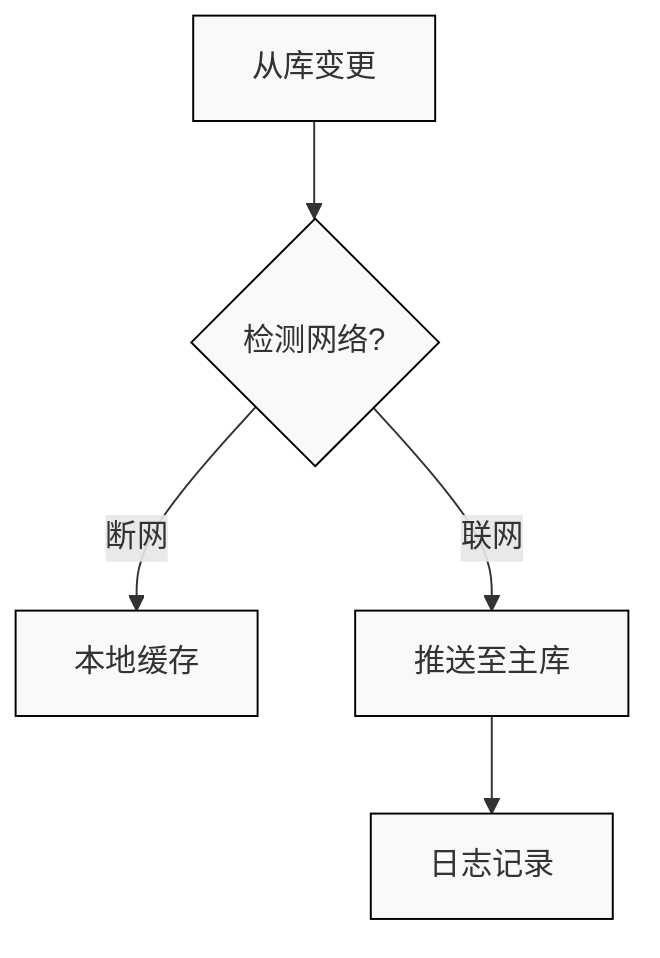

# 数据同步-前端数据库分离-项目介绍（1）：工控机断网优化实战

在工控机（Industrial Personal Computer）开发领域，数据库优化是核心痛点之一。想象一下：前端设备（如门禁系统）在断网环境下，无法与后端服务器实时同步数据，导致业务中断或数据不一致。这正是许多开发者面临的挑战。DataBaseAsync项目应运而生，它是一个基于.NET和EF Core的数据库复制系统，实现了前端数据库分离架构，支持断网场景下的数据同步。本文作为系列开篇，将总结项目的基本流程，帮助初学者快速理解并应用。无论你是工控机开发者还是数据库优化爱好者，这篇文章都能提供实用价值。

## 项目概述：为什么需要数据库分离？

DataBaseAsync的核心目标是解决工控机在断网环境下的数据一致性问题。传统架构中，前端直接连接后端数据库，一旦网络中断，整个系统瘫痪。项目引入“主从分离”设计：
- **主库（Leader）**：后端服务器，负责全局数据管理。
- **从库（Follower）**：前端工控机本地数据库，支持离线操作。
- **关键优势**：断网时，从库独立运行；联网后，自动同步变更，避免数据丢失。

从代码结构看（基于项目目录），核心文件包括：
- `LeaderDbContext.cs`：主库上下文，使用EF Core管理实体。
- `FollowerDbContext.cs`：从库上下文，实现本地缓存。
- `DatabaseBasedFollowerReplicator.cs`：复制逻辑核心，处理变更推送和冲突。
- Entity文件夹下多个业务实体（如`d_door.cs`、`d_truck.cs`），对应工控场景（如门禁、车辆管理）。

这个设计差异化于市面通用框架：它专为工控机优化，强调低资源消耗和断网鲁棒性。

## 基本流程总结：从初始化到同步

DataBaseAsync的流程可分为四个阶段：配置、初始化、变更检测与同步、冲突处理。以下基于代码总结，附简要原理和步骤（复杂逻辑配Mermaid流程图）。

### 阶段1：配置与初始化
首先，通过`appsettings.json`配置连接字符串和表映射。例如，主库连接到远程MySQL，从库使用本地SQLite。

代码示例（从`LeaderDbContext.cs`总结）：
```csharp
using Microsoft.EntityFrameworkCore;

public class LeaderDbContext : DbContext
{
    protected override void OnConfiguring(DbContextOptionsBuilder optionsBuilder)
    {
        optionsBuilder.UseMySql("server=leader;database=main", new MySqlServerVersion(new Version(8, 0)));
    }
    // 实体映射，如DbSet<d_door> Doors;
}
```

初始化时，系统创建复制日志表（ReplicationLogs），用于跟踪变更。原理：通过数据库触发器（AFTER INSERT/UPDATE/DELETE）实时捕获变更，并记录到 ReplicationLogs 表中，确保同步的原子性和实时性。

### 阶段2：变更检测与推送
当从库发生变更（如更新`d_drverinoutevidence`表的state字段），系统检测并推送至主库。核心在`DatabaseBasedFollowerReplicator.cs`中，使用重试机制处理网络波动。

流程图（Mermaid，适配暗黑主题）：


步骤：
1. 从库执行操作（如插入记录）。
2. 记录到本地日志。
3. 联网时，调用`ApplyChangesToLeader`方法推送。

### 阶段3：冲突处理
同步时可能冲突（如主从同时修改）。项目通过时间戳比较解决，特殊场景（如state=1）优先从库。

代码示例（从`DatabaseBasedFollowerReplicator.cs`总结）：
```csharp
private bool CheckLeaderReplicationLogForConflict(...) {
    // 冲突检测逻辑
    if (latestLeaderLog != null) {
        // 特殊处理d_drverinoutevidence
        if (tableConfig.TableName == "d_drverinoutevidence" && followerState == "1" && leaderState != "1") {
            return false; // 以从库为准
        }
        return true;
    }
    return false;
}
```

原理：比较日志时间戳，确保最新变更优先。

### 阶段4：断网分离优化
断网时，从库独立工作；联网后批量同步。优势：减少锁表风险，支持在线DDL删除外键。

## 结语：开启您的数据库优化之旅
DataBaseAsync简化了工控机数据同步，提供断网鲁棒性。通过本文的基本流程总结，您已掌握入门知识。系列后续将深入代码实现和优化技巧，欢迎关注！如果您有断网痛点，评论区交流！</content>